# Python-based-NX-Ply-Batch-geometry-data-extraction-&-material-optimization-analyzer
A Python/Tkinter journal for Siemens NX that batch processes ply data to generate manufacturing CSV reports. Features robust Area, perimeter, width and length calculation, automatic roll splicing analysis, and overlap waste estimation


## Demo


📺 **[Click here to watch the full High-Quality Video](assets/full_demo.mp4)**

---

## Problem Statement

In composite manufacturing (Wind Energy, Aerospace, Automotive), bridging the gap between **CAD Geometry** and **Raw Material Inventory** is a manual, error-prone process.

**The Manual Process:**
1.  **Roll compatibility:** Engineers must manually measure ply widths on curved surfaces to guess if they fit on standard stock (e.g., 1250mm rolls).
2.  **Cost Estimation:** Calculating the true surface area and perimeter for hundreds of plies to estimate fiber cost and CNC cutting time takes hours.
3.  **Splicing Errors:** Overlooking wide plies leads to "surprise" splicing on the shop floor, causing production delays and undocumented overlap weight.

**Result:** This manual analysis takes **hours together**, often leads to ordering incorrect roll sizes, and lacks accurate waste estimation.

---

## The Solution

I developed a Python script utilizing the **NXOpen API** to programmatically measure and analyze ply geometry. By inputting a list of `.prt` files, the algorithm measures every ply, compares it against manufacturing constraints, and outputs a detailed CSV report.

**Key Benefits:**
* **Production Readiness:** Instantly identifies which plies must be spliced (cut into 2+ pieces) to fit on standard rolls.
* **Cost Precision:** Calculates the exact **Overlap Waste ($m^2$)**—material that is paid for but essentially wasted in seams.
* **Robustness:** Uses a mathematical volume-based approach to calculate width, eliminating crashes common with standard "Bounding Box" tools on complex splines.

---

## Manufacturing Insights (How to use the Data)

This tool converts abstract geometry into actionable production metrics:

* **💰 Material Cost (Area):**
    * *Logic:* Extracts the Net Surface Area ($m^2$).
    * *Use:* Calculate exact fiber cost and resin consumption (for infusion) based on ply weight (GSM).
* **✂️ Consumable Cost (Perimeter):**
    * *Logic:* Sums the total edge lengths.
    * *Use:* Determines the exact linear meters of **Sealant Tape**, **Breather**, and **Peel Ply** required for vacuum bagging also helpful in estimating material cutting machine cycle time.
* **📦 Roll Management (Avg Width):**
    * *Logic:* Compares Ply Width vs. Stock Width (1.25m).
    * *Use:* Automates the decision to order wide-format rolls vs. standard rolls.

---

## Architecture & Logic

The script follows a modular calculation pipeline:

```mermaid
graph LR
    %% Style Definitions
    classDef user fill:#e1f5fe,stroke:#01579b,stroke-width:2px,rx:10,ry:10;
    classDef config fill:#fff9c4,stroke:#fbc02d,stroke-width:2px,rx:0,ry:0;
    classDef process fill:#f3e5f5,stroke:#4a148c,stroke-width:2px,rx:5,ry:5;
    classDef decision fill:#e8f5e9,stroke:#1b5e20,stroke-width:2px,rx:5,ry:5,shape:diamond;
    classDef error fill:#ffcdd2,stroke:#c62828,stroke-width:2px,rx:5,ry:5;
    classDef endnode fill:#e1f5fe,stroke:#01579b,stroke-width:2px,rx:10,ry:10;

    %% Nodes
    Start((User Starts Tool)):::user
    
    subgraph GUI[" 🖥️ GUI Configuration "]
        direction LR
        GUI_Open[GUI Opens]:::config
        Sel_Mod[Select Model]:::config
        Sel_Out[Select Output]:::config
        Ent_Grp[Enter Group Name]:::config
        Click_Exp[Click 'Start Measure']:::config
    end
    
    Start --> GUI_Open --> Sel_Mod --> Sel_Out --> Ent_Grp --> Click_Exp

    Open_Mod[Open Model]:::process
    Click_Exp --> Open_Mod

    Check_Grp{Group Found?}:::decision
    Open_Mod --> Check_Grp

    Log_Err[Log Error]:::error
    Check_Grp -- No --> Log_Err

    Iterate[Iterate Curves]:::process
    Check_Grp -- Yes --> Iterate

    subgraph CoreLogic[" ⚙️ Core Logic "]
        direction TB
        Measure[Measure Area & Length]:::process
        CalcW[Calc Avg Width]:::process
        Splice[Calc Splices & Waste]:::process
    end

    Iterate --> Measure --> CalcW --> Splice

    CSV[Write to CSV]:::process
    Splice --> CSV

    Done((Done)):::endnode
    CSV --> Done
    Log_Err --> Done
```



**1. Geometric Reconstruction (Area Extraction)**
Before measuring, the script must define what to measure. Since the inputs are just boundary curves (wires), the script programmatically performs a "Fill Surface" operation in memory.Logic: It constructs a temporary analytical surface (Sheet Body) bounded by the composite curves.Result: This allows the NX Math Kernel to calculate the precise Net Surface Area ($m^2$), accurately accounting for double-curvatures that simple 2D approximations miss.

**2. Robust Width Algorithm**
Standard API bounding boxes often fail on organic composite shapes (e.g., C-channels or twisted spar caps). This tool derives width mathematically using the data from 
Step 1: $$Width_{Avg} = \frac{\text{Surface Area } (m^2)}{\text{Longest Edge Length } (m)}$$

Why: This ensures a valid manufacturing width is returned 100% of the time, even when the geometry is too complex for a standard bounding box.

**3. Splicing & Waste Logic**
The script finally compares the derived dimensions against your specific manufacturing constraints (e.g., 1250mm Roll Width).Splice Detection: If $Width > 1.25m$, it calculates pieces required: $\lceil \frac{Width}{Roll} \rceil$.Waste Calculation: It calculates the "hidden cost" of overlaps: $$Waste = (Pieces - 1) \times Length \times Overlap_{50mm}$$

---

## Technical Implementation Details

The application is built on a **hybrid architecture** combining a standard Python GUI (Tkinter) with the proprietary **Siemens NXOpen API**.

### 1. NX Environment Integration
* **Dynamic Re-mapping:** The script dynamically re-maps `TCL_LIBRARY` and `TK_LIBRARY` paths at runtime. This resolves the conflict between the standard Python interpreter and Siemens NX's embedded Tcl/Tk environment, ensuring the GUI renders correctly.
* **Headless Measurement:** Utilizes `Features.FreeformSurfaceCollection.CreateFillHoleBuilder` to create temporary analytical surfaces in memory to extract precise mass properties without altering the user's file.

### 2. The Extraction Algorithm
The core logic (`_perform_measurement`) follows a manufacturing-logic pipeline:
* **Part Traversal:** Iterates through user-selected directories.
* **Smart Filtering:** Filters for specific `FeatureGroups` (e.g., "ROOT_PREFAB") to ignore non-ply geometry.
* **Safety Checks:** Implements error handling for "Zero-Length" edges or un-parameterized bodies to prevent script crashes during large batch jobs.

### 3. Memory & Resource Management
* **Garbage Collection:** Implements a strict "Undo to Mark" routine. Temporary measurement surfaces are created, measured, and immediately undone/destroyed to prevent file corruption or bloating.
* **Event Loop:** Uses manual `self.update()` calls to keep the Tkinter UI responsive while NX performs heavy geometric calculations in the background.

---

## Code Snippet

The core logic that handles the Splicing and Waste calculation:

```python
def _perform_measurement(self, work_part, curve):
    # 1. GEOMETRIC RECONSTRUCTION
    # Programmatically create a temporary "Fill Surface" from curves
    # to extract precise area properties (impossible from curves alone).
    builder = work_part.Features.FreeformSurfaceCollection.CreateFillHoleBuilder(...)
    # ... (Builder configuration) ...
    body = builder.CommitFeature().GetBodies()[0]

    # 2. MEASURE MASS PROPERTIES
    mass_props = work_part.MeasureManager.NewMassProperties([], 0.99, [body])
    area_m2 = (mass_props.Volume / 1000.0) / 1000000.0 
    length_m, perim_m = get_edge_stats(body)
    
    # 3. ROBUST WIDTH CALCULATION
    if length_m > 0: avg_width_m = area_m2 / length_m
    
    # 4. SPLICING LOGIC (1250mm Roll)
    usable_roll = ROLL_WIDTH_M - SAFETY_MARGIN 
    
    if avg_width_m > usable_roll:
        pieces = math.ceil(avg_width_m / usable_roll)
        # ... (waste calc) ...

    return area_m2, avg_width_m, length_m, perim_m, splices, waste_m2

 ```

## Source Code & Collaboration
This project is currently only for portfolio demonstration. The full source code (Python scripts, NXOpen implementation, and Tkinter GUI) is available for Code Review or Collaboration upon request.

How to Request Access
I am actively looking for collaborators and feedback! If you are a hiring manager or developer interested in the technical details:

Email: Aneesh.binage06@gmail.com

LinkedIn: [Aneesh Shridhar B](https://www.linkedin.com/in/aneesh-shridhar-b-165468154/)

Upon request, I can add you as a Collaborator to the repository or provide a secure code walkthrough.

